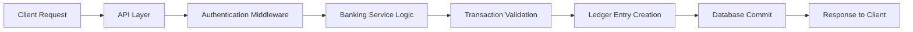

# 🔐 SecureLedger — Banking Backend System

<p align="center">
  <b>A Modern Ledger-Driven Banking Backend</b><br>
  Secure • Scalable • Transaction-Safe
</p>

<p align="center">


</p>

---

## 🚀 Project Overview

**SecureLedger** is a modern banking backend system designed to simulate real-world financial infrastructure.

The project demonstrates how secure digital banking platforms handle:

* Authentication & authorization
* Account operations
* Atomic money transfers
* Ledger-based accounting
* Secure transaction processing

Built as a **portfolio-grade backend system**, SecureLedger focuses on real fintech architecture used in banking systems.

---

## 🧠 Core Features

✅ Secure User Authentication & Authorization
✅ Account Management System
✅ Balance Inquiry System
✅ Atomic Money Transfer Workflow
✅ Double-Entry Ledger Recording
✅ Secure REST API Handling
✅ Error Handling & Validation
✅ Modular & Scalable Architecture

---

## ⚙️ Tech Stack

| Layer            | Technology            |
| ---------------- | --------------------- |
| Backend          | Node.js + Express.js  |
| Database         | MongoDB               |
| Authentication   | JWT (JSON Web Tokens) |
| API Architecture | REST API              |
| Version Control  | Git & GitHub          |

---

## 🏗️ System Workflow



This workflow ensures **atomic and consistent financial operations** similar to real banking systems.

---

## 🧩 Architecture Diagram

> Add your exported diagram later inside `/docs/architecture.png`

```md

```

---

## 📁 Project Structure

```
SecureLedger/
│
├── controllers/     # Request handling logic
├── routes/          # API endpoints
├── models/          # Database schemas
├── services/        # Core banking logic
├── middleware/      # Authentication & validation
├── config/          # Database & environment setup
└── server.js        # Application entry point
```

---

## 🛠️ Installation & Setup

```bash
# Clone repository
git clone https://github.com/your-username/SecureLedger.git

# Enter project
cd SecureLedger

# Install dependencies
npm install

# Start development server
npm run dev
```

Server runs at:

```
http://localhost:PORT
```

---

## 🔑 Example API Endpoints

| Method | Endpoint            | Description           |
| ------ | ------------------- | --------------------- |
| POST   | `/api/auth/login`   | User login            |
| GET    | `/api/account`      | Fetch account details |
| GET    | `/api/balance`      | Check balance         |
| POST   | `/api/transfer`     | Transfer funds        |
| GET    | `/api/transactions` | Transaction history   |

---

## 📁 Project Structure

```
SecureLedger/
│
├── Src/
│   ├── controllers/        # Request handling logic
│   │   ├── auth.controllers.js
│   │   ├── account.controller.js
│   │   └── transcation.controller.js
│   │
│   ├── routes/             # API routes
│   │   ├── auth.routes.js
│   │   ├── account.routes.js
│   │   └── transaction.routes.js
│   │
│   ├── models/             # Database schemas
│   │   ├── user.model.js
│   │   ├── account.model.js
│   │   ├── transaction.model.js
│   │   ├── ledger.model.js
│   │   └── blacklist.model.js
│   │
│   ├── services/           # Business logic
│   │   └── email.service.js
│   │
│   ├── middleware/         # Auth & validation
│   │   └── auth.middleware.js
│   │
│   ├── config/             # DB & environment configs
│   │   └── db.js
│   │
│   ├── templates/          # Email templates
│   │   ├── welcome.email.html
│   │   └── login.email.html
│   │
│   └── App.js              # Express app configuration
│
├── server.js               # Application entry point
├── package.json            # Dependencies
├── .env                    # Environment variables
└── .gitignore              # Git ignore rules
```
## 📬 API Testing (Postman Example)

Add screenshots inside `/docs/` folder:

```md

```

---

## 🗄️ Database Schema (Optional)

```md

```

---

## 🔒 Security Concepts Implemented

🔐 JWT Authentication
🧾 Ledger-Based Accounting System
🛡️ Transaction Atomicity using DB Sessions
✅ Request Validation
⚠️ Structured Error Handling

---

## 📈 Future Improvements

* Fraud Detection Engine
* Rate Limiting & API Gateway
* Microservices Architecture
* Queue-Based Transaction Processing
* Email / SMS Notifications
* Admin Dashboard

---

## 🎯 Purpose

This project is built to deeply understand how **real banking backend systems operate internally** and to showcase backend engineering skills for internships and placements.

---

## 👨‍💻 Author

**Tanmay**
Backend Developer | Computer Science Student

---

## ⭐ Support

If you found this project useful, consider giving it a ⭐ on GitHub!
